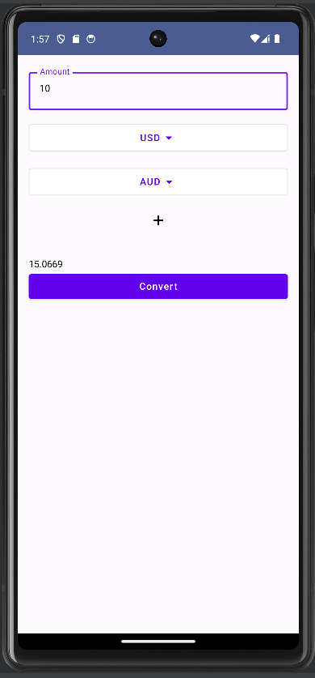

# ExchangeApp

ExchangeApp - это приложение для конвертации валют, разработанное с использованием современных технологий и архитектурных подходов.

## Технологии и подходы

- **Jetpack Compose** - для создания современного пользовательского интерфейса.
- **Clean Architecture** - для структурирования кода и обеспечения его масштабируемости и тестируемости.
- **Kotlin** - основной язык программирования.
- **MVVM** (Model-View-ViewModel) - архитектурный паттерн для разделения бизнес-логики и пользовательского интерфейса.
- **Coroutines & Flow** - для асинхронного выполнения задач и обработки потоков данных.

## Описание проекта

Приложение реализует функции конвертации валют с одной валюты на другую и функционал мультивалютной конвертации. Можно выбрать несколько конвертируемых валют

## Скриншоты

- 
## Установка и запуск

1. Клонируйте репозиторий:
   ```sh
   git clone https://github.com/idar1o/ExchangeApp.git
   ```

2. Перейдите в каталог проекта:
   ```sh
   cd ExchangeApp
   ```

3. Откройте проект в Android Studio и синхронизируйте зависимости.

4. Запустите приложение на эмуляторе или реальном устройстве.

Спасибо за внимание!
